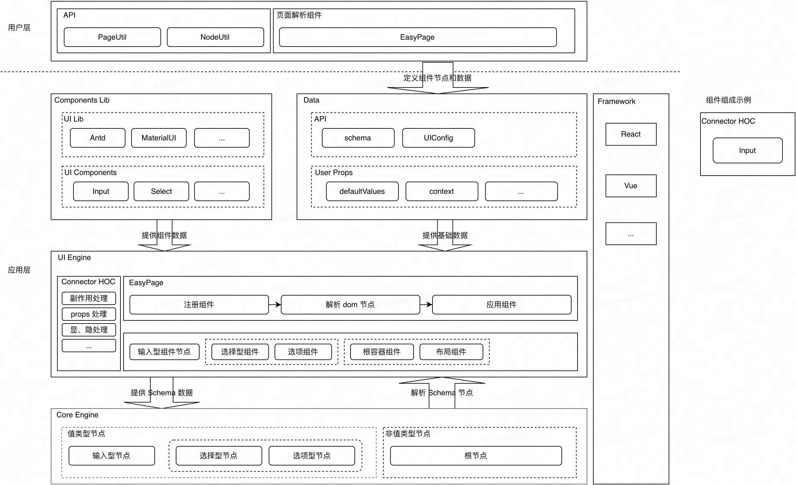

# Engine 设计

引擎分三层：
- `CORE ENGINE`：解析 Schema 的引擎，将其节点解析出来。
- `UI ENGINE`：将节点解读成 UI 类型节点，如：输入型节点、选择节点、容器节点
- `UI COMPONENTS`：结合具体 UI 库，将解析出的节点用对应的 UI 组件渲染出来

## `@easy-page/core`
此包就是：“CORE ENGINE” 层，主要作用就是将：`Schema` 解读成对应的节点和节点关系。

## `@easy-page/react-ui`
此包将节点和节点关系进一步解读成：React UI 节点。

## `@easy-page/antd-ui`
此包基于上述解析，通过注册对应的 UI 组件进行渲染。